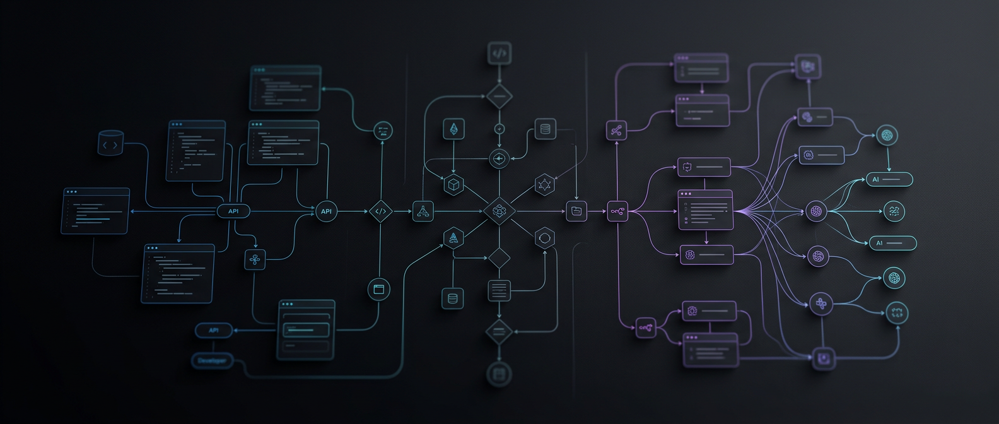

<p align="center">
  
</p>
 
<h1 align="center">AI-first product engineering</h1>

<p align="center">
  Building deeply AI-integrated systems with agents, MCP servers, n8n automation, SDKs, and AI-native developer workflows.
</p>

<p align="center">
  <a href="https://github.com/salacoste?tab=followers">
    
  </a>
  <a href="https://github.com/salacoste/mcp-n8n-workflow-builder">
    
  </a>
</p>

<p align="center">
  
  
  
  
  
</p>

---

## What I build

I build AI-first products and deeply AI-integrated systems.

For me, **AI-first** does not mean adding a chatbot to an existing product.

It means designing products where AI agents, workflows, APIs, automation, data, and developer tools are part of the core architecture from the beginning.

My focus areas:

* AI-first product architecture
* AI agents and agentic workflows
* MCP servers for Claude, Cursor, and AI-native IDEs
* n8n automation powered by natural language
* TypeScript SDKs for marketplace and business APIs
* Developer tools for AI-assisted engineering
* Internal automation systems for real business operations

I build practical systems that connect AI with real workflows: APIs, CRMs, marketplaces, documents, databases, backend services, automation pipelines, and operational processes.

---

## Featured projects

| Project                                                                                               | What it does                                               |
| ----------------------------------------------------------------------------------------------------- | ---------------------------------------------------------- |
| [mcp-n8n-workflow-builder](https://github.com/salacoste/mcp-n8n-workflow-builder)                     | Build and manage n8n workflows through AI and MCP          |
| [antigravity-bmad-config](https://github.com/salacoste/antigravity-bmad-config)                       | Structured AI-agent development workflow template          |
| [ozon-daytona-seller-api](https://github.com/salacoste/ozon-daytona-seller-api)                       | TypeScript SDK for OZON Seller API                         |
| [daytona-wildberries-typescript-sdk](https://github.com/salacoste/daytona-wildberries-typescript-sdk) | TypeScript SDK for Wildberries Marketplace API             |
| [codex-account-switch-backups](https://github.com/salacoste/codex-account-switch-backups)             | CLI tool for Codex account switching and encrypted backups |
| [openapi-mcp-generator](https://github.com/salacoste/openapi-mcp-generator)                           | OpenAPI and MCP generation tooling                         |

---

## My approach

I believe the next generation of software will not be built as traditional apps with AI features attached later.

It will be built as AI-native systems from the ground up.

That means:

* agents are part of the product logic;
* workflows are designed for human + AI collaboration;
* APIs are first-class interfaces for agents;
* automation is observable and testable;
* developer tools are integrated into the product lifecycle;
* AI is used to operate, extend, and improve the system itself.

This is the direction I am building in.

---

## Main stack

```text
TypeScript · JavaScript · Python · Rust · Go
MCP · n8n · Claude · Cursor · BMad Method
Node.js · APIs · SDKs · Automation · Agentic Workflows
```

---

## Follow for more
 
* AI-first product engineering
* deeply AI-integrated systems
* MCP and agent infrastructure
* n8n automation
* AI-native developer workflows
* marketplace and business API automation
* internal tools powered by agents
* practical systems for real-world operations

My projects are focused on production-useful automation, not just demos.

I publish tools, experiments, and implementation patterns that are meant to be used in real projects.

<p align="center">
  <a href="https://github.com/salacoste?tab=followers">
    <strong>Follow @salacoste for AI-first product engineering</strong>
  </a>
</p>

---

## Current direction

I am building around the idea that AI agents become useful when they can safely interact with real systems.

That means:

* APIs instead of screenshots;
* workflows instead of one-off prompts;
* typed SDKs instead of fragile scripts;
* repeatable development processes instead of chaotic agent sessions;
* automation that can be inspected, tested, and improved.

 
